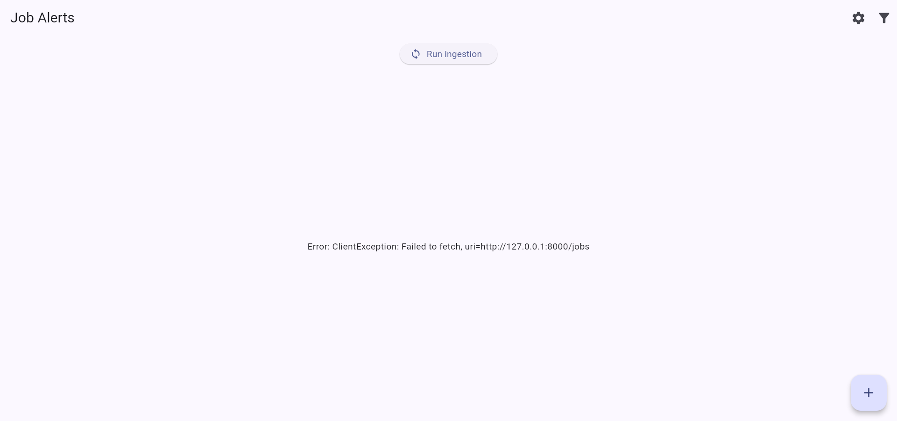

# Bot Docs

Full technical documentation for the Job Alert Platform. The top-level [README](../README.md) is the quick-start; this is everything else — architecture, API, job-source setup, deployment, and testing.

- **[ARCHITECTURE.md](ARCHITECTURE.md)** — the three layers, backend/frontend file-by-file breakdown, SQLite schema, the ingestion flow step by step, and the full API reference.
- **[SOURCES.md](SOURCES.md)** — how to turn on each job source (Telegram, LinkedIn/Naukri via email, RSS/JSON feeds), which sources were evaluated and rejected (and why), and the full environment variable reference.
- **[OPERATIONS.md](OPERATIONS.md)** — running locally, deploying via GitHub Actions as the always-on runner, where run history/logs live, testing, and CI/CD.

No secrets live in any of these docs — only variable *names*, purposes, and non-secret defaults. Real values always go in `backend/.env` (gitignored) or GitHub repository secrets.

## Screenshot

The Flutter dashboard's home screen. This particular capture was taken with the backend not running (hence the fetch error) — it's kept here just to show the actual UI shell (header, "Run ingestion" button, empty-state layout), not as a polished demo.
